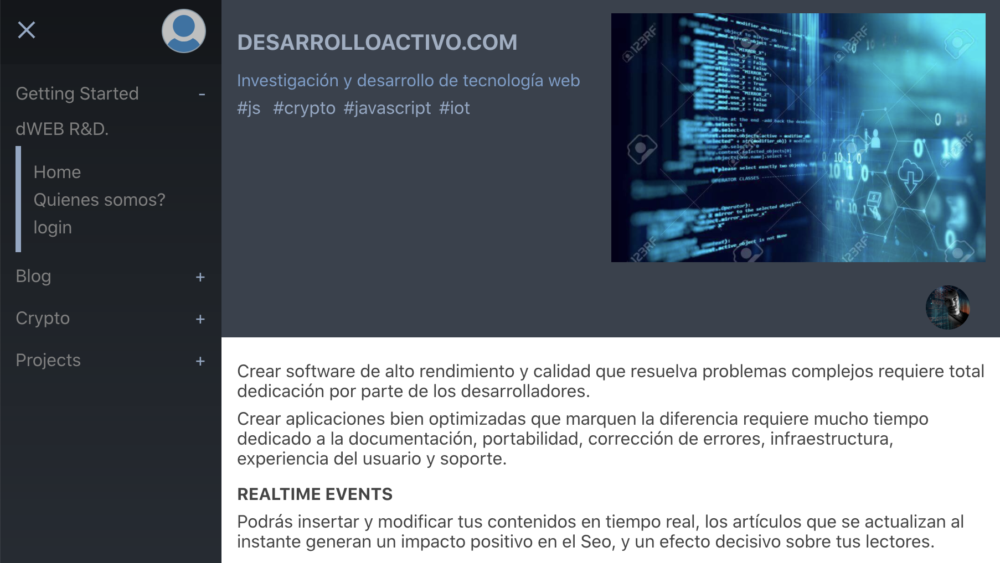

# Dinamical

Distributed Realtime Blog Aplication (WPA)

## ScreenShoot



### Deploy gun sever on [Heroku](https://www.heroku.com/)

[](https://heroku.com/deploy?template=https://github.com/amark/gun)

 > Heroku deletes your data every 15 minutes, one way to fix this is by adding [cheap storage](https://gun.eco/docs/Using-Amazon-S3-for-Storage).

Or:

```bash
git clone https://github.com/amark/gun.git
cd gun
heroku create
git push -f heroku HEAD:master
```
Then visit the URL in the output of the 'heroku create' step, in a browser.

-------------

#### Credits & Thanks
* [Mark's GUN](https://gun.eco/) and its community!

* [by estebanrfp](https://desarrolloactivo.com/)
